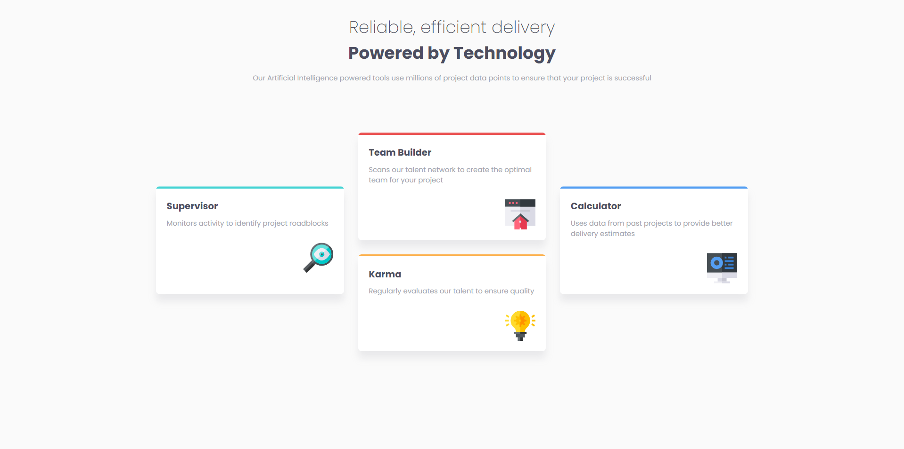
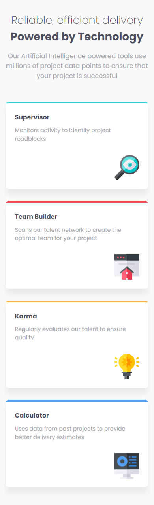

# Sección de tarjetas informativas

Este proyecto es una propuesta de solución para uno de los desafios de Frontend Mentor, todos los recursos utilizados fueron obtenidos mediante dicha plataforma.

Dentro de este repositorio se muestra una página web en la que se muestran 4 tarjetas informativas con un diseño propuesto, de manera que el contenido se va acoplando según las resoluciones de pantalla a la que está expuesto la página.

## Table of contents

- [Descripción](#descripción)
  - [Desafio](#desafio)
  - [Screenshot](#screenshot)
  - [Links](#links)
- [Proceso](#proceso)
  - [Hecho con](#hecho-con)
  - [Lo que aprendí](#lo-que-aprendí)


## Descripción

### Desafio

El desafio propuesto fue codificar un conjunto de 4 tarjetas según un diseño dado, mientras que para dispositivos mayores a ```768px``` tiene cierta agrupación de items, para resoluciones menores se comportará como un conjunto de columnas tradicionales.

En paralelo, los margenes, paddins y tamaños de fuentes iran aumentando o disminuyendo según las resolución de pantalla actual.

### Screenshot

#### Escritorio


#### Movil



### Links


- Sitio: [-](#)

## Proceso

### Hecho con

- HTML
- CSS 
  - Flexbox
  - Grid
  - Media Queries


### Lo que aprendí

Hasta ahora es el desafío mas complicado que he realizado, esto por varios factores como la manera de aumentar o disminuir dinámicamente el tamaño de fuentes, contenedores, etc.

Aprendí a usar de una mejor manera los __Media Queries__ para cambiar propiedades de contenedores en especifico, como lo puede ser el tamaño y distribución de tarjetas y otros detalles. Tambien aprendi a utilizar la propiedad ```TranslateY()``` para mover verticalmente 2 de las 4 tarjetas y así reflejar el diseño propuesto.